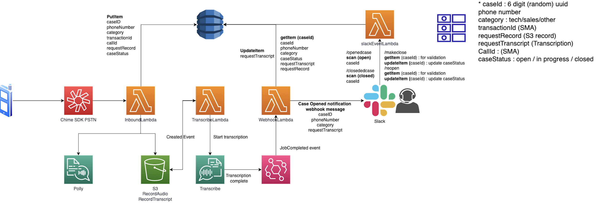

# Notifying slack for incoming voice message with Amazon Chime SIP Media Applications

This demo will build and configure several services within AWS so that you can leave a call voice message from one Amazon Chime SIP media application to slack.
Voice message transcripted with Transcribe, and notified to slack webhook.

## Overview

## Requirements

- node V12+/npm [installed](https://www.npmjs.com/get-npm)
- yarn [installed](https://yarnpkg.com/getting-started/install)
- AWS CLI [installed](https://docs.aws.amazon.com/cli/latest/userguide/install-cliv2.html)
- Ability to create a Chime SIP media applications and Phone Numbers (ensure your [Service Quota](https://console.aws.amazon.com/servicequotas/home/services/chime/quotas) in us-east-1 for Phone Numbers have not been reached)
- Deployment must be done in us-east-1 or us-west-2 to align with SIP media application resources

## Deployment

- Clone this repo: `git clone https://github.com/limsuky/incoming-call-update`
- `cd incoming-call-update`
- `./deploy.sh`

## Resources Created

- Three Lambda Functions
  - inboundSMA Lambda: Used to process inbound calls with Chime SMA
  - createTranscription Lambda: Used to create transcription from SMA recording in S3 bucket. 
  - slackWebWook Lambda : Used to send slack webhook message that contains voice memo and caller information.
  - slackEvent Lambda : Used to integrate with Slack command and DynamoDB do get cases and change case status.
  - createWav Lambda: Used to create wav files from Polly and store in S3 for SMA lambdas to use as audio source
- Three Chime SIP Media application rules
  - inbound SMA rule with phone number
  - emulator SMA rule with phone number for sales
  - emulator SMA rule with phone number for support
- Two Chime SIP media applications
  - inbound SMA pointing to inboundSMA Lambda
  - emulator SMA pointing to emulatorSMA Lambda
- One DynamoDB used to store information when passing between SIP media applications
- One S3 Bucket used to store wav files for play on SIP media applications

## Operation

In this demo, you will be creating a Chime SIP media application. The SMA, `inboundSMA.js` is created and assocaited with a phone number `inboundPhoneNumber` that is part of the CDK output. The `inboundSMA` Lmabda also create audio record file that caller left voice message. With given information getting from IVR actions, the data will be stored in to Dynamo DB.
The S3 event (record file created) triggers `createTranscription.py` to create transcription using Amazon Transcribe service. When `Job Completed` event from event bridge will sent a event to `slackEvent.js` Lambda to assemble all caller data and synchronise with Dynamo DB, and send webWook message to slack.
In addition, `slackEvent.js` interacts with slack commands such as `/openedcase`, `/closedcase` to query current case status, and `/makeclose` and `/reopen` command to make change case status that integrate with case management system (Dynamo DB in this demo).

To test this out, from a normal phone, place a call to the `inboundPhoneNumber`. The `inboundSMA` will first check to see if the calling number has an assocaited account ID. If it does, it plays a message and requests a DTMF response of '1' for technical or '2' for sales or '3' for other inqueries. Once a selection has been made, this SMA will request leave a message and record the voice message. 

## Cleanup

To clean up this demo, please use `npx cdk destroy` or delete the stack in CloudFormation. Additionally, phone numbers and SIP media application should be removed from the Chime console manually.

## Security

See [CONTRIBUTING](CONTRIBUTING.md#security-issue-notifications) for more information.

## License

This library is licensed under the MIT-0 License. See the LICENSE file.

## Topics

Programmable Voice, Voice APIs, SIP media application, Amazon Chime SDK, Amazon Polly
